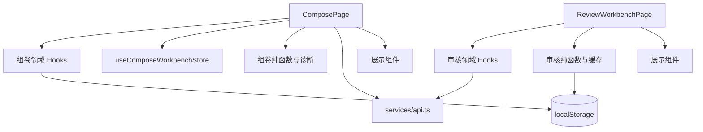

# 代码地图 2 附录：前端组卷与审核工作台函数地图

> 对应方案：[前端组卷与审核工作台优化](02-frontend-workbenches.md)
> 快照日期：2026-08-10
> 目的：明确每个工作台函数的归属、输入输出与副作用，为后续拆分提供不改变行为的迁移边界。

## 1. 阅读规则

- **纯函数**：输入相同，输出相同；不得访问 React、HTTP、`localStorage` 或 store。
- **领域 Hook**：可以协调状态、HTTP、浏览器存储和异步流程，但不得渲染 JSX。
- **页面容器**：只保留路由、布局和 Hook 装配；不再新增领域规则。
- **展示组件**：只接收 props/回调，可保留本地展示状态；不得直接调用页面 API。



## 2. 组卷工作台函数地图

### 2.1 状态分区

| 分区 | 当前载体 | 内容 | 目标归属 |
| --- | --- | --- | --- |
| 文档条目 | `useComposeWorkbenchStore` | `items`、选中位置、事务、撤销/重做、修订号 | 保持 store |
| 草稿会话 | `useComposeDraftSession` | 草稿 id、服务端更新时间、题篮合并、远端刷新 | 已迁出；页面只消费会话状态 |
| 文档设置 | `ComposePage` 的 state/refs | 标题、页眉页脚、版式、幻灯片模板、设置历史 | `useComposeSettingsHistory` |
| 画布交互 | `ComposePage` 的 state/callbacks | 选中、多选、拖拽、行内编辑、键盘操作 | `useComposeItemActions` |
| 教学蓝图 | `ComposePage` 的 state/callbacks | 蓝图预览、规则、补题候选与应用 | `useTeachingBlueprint` |
| 预览与诊断 | `ComposePage` 的 memo/effects | LessonPackage、分页测量、诊断、缩放 | `useComposePreview` |
| 视图开关 | `ComposePage` | 大纲、检查器、预览模式、面板显示 | 页面保留 |

### 2.2 页面级函数与迁移边界

| 函数/逻辑 | 当前职责与输出 | 副作用/依赖 | 后续归属 |
| --- | --- | --- | --- |
| `makeId` | 生成文本、分页等 ComposeItem 标识 | 时间、随机数 | `utils/compose/*` |
| `getComposePageSizeMm` | 从版式推导页面毫米尺寸 | 无 | `utils/compose/*` |
| `buildComposeItemsFromQuestions` | 题库题目转换为 `ComposeItem[]` | 无 | `utils/composeDraft.ts` 或 `utils/compose/*` |
| `getPrimaryKnowledge` | 选择题目的主知识点展示值 | 无 | `utils/compose/*` |
| `isEditableTarget` | 判断键盘事件是否来自可编辑控件 | DOM 类型判断 | `hooks/compose` 的键盘辅助函数 |
| `hydrateServerDraft` | 获取缺失题目快照、合并题篮、恢复草稿标题与条目 | HTTP、localStorage、store、React state | 已迁至 `useComposeDraftSession` |
| 初始加载 effect | 在“已记忆草稿 / 路由包 / 最新草稿 / 题篮”间选择入口 | HTTP、React Query、store、localStorage | 已迁至 `useComposeDraftSession` |
| 题篮增量合并 effect | 将尚未包含的题篮题目追加到文档 | HTTP、store | 已迁至 `useComposeDraftSession` |
| 服务端草稿轮询 effect | 空闲时发现远端新版本并重新 hydrate | HTTP、React Query | 已迁至 `useComposeDraftSession` |
| `applySettingsSnapshot`、`updateSettings` | 应用设置快照，维护 900ms 合并、60 条上限的历史 | React state、用户偏好存储 | `useComposeSettingsHistory` |
| `setLessonTitle`、`setLessonSubtitle`、`setHeaderFooter`、`setStyleConfig` | 设置字段的受控更新入口 | 设置历史 | `useComposeSettingsHistory` |
| `undoSettings`、`redoSettings` | 设置快照撤销/重做 | 设置历史 refs | `useComposeSettingsHistory` |
| `undoWorkspace`、`redoWorkspace` | 按最后真实变更选择条目栈或设置栈 | store + 设置历史 refs | 工作台协调 Hook |
| `selectCanvasItem`、`editCanvasItem`、`finishInlineEdit`、`cancelInlineEdit` | 选择、多选与行内编辑编排 | React state、store | `useComposeItemActions` |
| `handleCanvasDragEnd`、`handleMoveSelection` | 处理拖拽和上下移动 | store | `useComposeItemActions` |
| `insertAtSelection`、`updateSelected*` | 在选区插入或更新不可变条目 | store | `useComposeItemActions` |
| `handleAdd*`、`handleDuplicateSelection`、`handleDeleteSelection`、`handleClearAll` | 新增、复制、删除、清空文档条目 | store、题篮、浏览器确认框 | `useComposeItemActions` |
| `handleAutoLayout` | 去除连续分页并归一化图片/版式设置 | store、设置历史 | `useComposeItemActions` + 纯规则 |
| `handleBuildTeachingBlueprint` | 从当前条目推导蓝图预览 | 纯计算、React state | `useTeachingBlueprint` |
| `handleApplyTeachingBlueprint` | 应用经确认的蓝图条目 | store | `useTeachingBlueprint` |
| `handleFindSupplementCandidates`、`handleAddSupplementCandidates` | 搜索补题候选并显式应用 | HTTP、store | `useTeachingBlueprint` |
| `legacyLessonPackage`、`previewLessonDocument`、`previewLessonPackage`、`previewLayoutModel`、`previewModel`、`diagnostics`、`paginationReport` | 从编辑状态推导预览与检查结果 | 纯计算；测量结果来自 DOM effect | `useComposePreview` |
| `handleSaveCurrent`、`openLessonRoute` | 保存工作包或切换到讲义/幻灯片/课堂页 | 本地库写入、路由 | 页面保留为路由装配 |
| `nudgeZoom` | 调整预览缩放 | React state | 页面或 `useComposePreview` |

### 2.3 组卷调用路径

```text
路由状态 / 题篮 / 当前草稿 id
  → 初始加载 effect
  → hydrateServerDraft / 题目转换
  → useComposeWorkbenchStore.items
  → 预览模型 + 诊断 + HandoutDocument
  → 保存工作包 / 进入目标路由

用户操作
  → useComposeItemActions
  → store.commitItems 或 transaction（一次操作一次提交）
  → store.revision
  → 草稿持久化与预览更新
```

## 3. 审核工作台函数地图

### 3.1 状态分区

| 分区 | 当前载体 | 内容 | 目标归属 |
| --- | --- | --- |
| 审核草稿 | `ReviewWorkbenchPage` state | `drafts`、`knowledgeDrafts`、原始快照 | 页面经 `useReviewQueue` / 编辑 Hook 消费 |
| 队列与质检 | `useReviewQueue` + `utils/review/reviewQueue.ts` | 风险报告、计数、筛选结果、当前题与导航 | 已迁出；页面只消费结果 |
| 本地缓存 | `services/review/reviewCache.ts` + page effect | localStorage 缓存、质量偏好、任务元数据 | 已迁出；页面只决定保存时机 |
| 服务端草稿 | refs + callbacks + effects | 乐观锁、串行保存、冲突、历史版本 | `useReviewDraftPersistence` |
| AI 与媒体 | callbacks | 单题建议、批处理、图片上传/插入 | 独立领域 Hook；UI 仅接收回调 |
| 视图状态 | page state | 面板、查询、当前页、弹窗 | 页面或展示组件保留 |

### 3.2 已抽离的纯函数：`utils/review/reviewDraft.ts`

| 函数 | 输入 → 输出 | 兼容规则 |
| --- | --- | --- |
| `normalizeOptions` | 未知值 → `Option[]` | 非数组/无效项变为空；数学文本保持既有规范化 |
| `normalizeSourceBBox` | 未知值 → 坐标元组或 `null` | 仅接受 4 个有限数字 |
| `computeFigureIssues` | 题目内容 → 图片引用问题 | 同时找出未引用图片与缺失图片引用 |
| `normalizeDraft` | API/缓存对象 → `ReviewQuestionDraft` | 补安全默认值；无效状态回退为 `pending`；实验语义覆盖误判的选择题 |
| `normalizeKnowledgeDraft` | API/缓存对象 → `KnowledgeReviewDraft` | 补稳定 draft id 与安全默认值 |
| `cloneDraft` | 草稿 → 深拷贝草稿 | 用于原始快照与恢复 |
| `getChangedReviewFields` | 原始/当前草稿 → 差异字段列表 | 仅比较审核变更面板支持的字段 |
| `displayReviewValue` | 任意值 → 展示文本 | 空值显示“（空）”；兼容数组、选项与图片 |
| `applyAiPatch` | AI 文本 → 安全 patch | JSON 仅接受白名单字段；解析失败时整段文本进入 `analysis` |

### 3.3 审核页面级函数与迁移边界

| 函数/逻辑 | 当前职责与输出 | 副作用/依赖 | 后续归属 |
| --- | --- | --- |
| `reviewCacheKey`、`readReviewCache`、`writeReviewCache`、`clearReviewCache` | 管理指定任务的缓存读写 | localStorage | `services/review/reviewCache.ts` |
| `mergeMediaAssets`、`mediaAssetsFromDrafts`、`mergeTaskMeta` | 合并任务与草稿中的图片元数据 | 无 | `services/review/reviewCache.ts` |
| `readQualityConfig`、`writeQualityConfig` | 管理质检偏好 | localStorage | `services/review/reviewCache.ts` |
| `appendTableTemplate`、`fileUrl` | 编辑器文本/文件 URL 辅助 | 无 | `utils/review/*` |
| `getKnowledgeRisks` | 计算知识点草稿的必填缺失项 | 无 | `utils/review/*` |
| `getRiskItems`、`matchesQueue` | 从质量规则生成风险项和队列匹配结果 | 依赖 `questionQuality`，无副作用 | 已迁至 `utils/review/reviewQueue.ts` |
| `loadReviewTasks`、任务列表 effect | 加载未指定 taskId 时的审核任务列表 | HTTP、React state | `useReviewTaskList` |
| `handleDeleteReviewTask` | 二次确认后删除队列任务并清缓存 | HTTP、localStorage、浏览器确认框 | `useReviewTaskList` |
| 初始加载 effect | 加载导入任务、服务端草稿、图片；按“较新本地缓存 > 服务端草稿 > 导入结果”恢复 | HTTP、localStorage、React state | `useReviewDraftPersistence.load` |
| 远端同步 effect | 空闲时轮询导入结果，保留当前题位置并重算队列 | HTTP、React state | `useReviewDraftPersistence.refreshRemoteTask` |
| `qualityReport`、`counts`、`filteredDrafts` | 生成质检报告、队列计数和搜索结果 | 纯 memo | 已迁至 `useReviewQueue` |
| 本地缓存 effect | 500ms 防抖保存可恢复的本地草稿 | localStorage | `useReviewDraftPersistence` 调用缓存服务 |
| `flushServerDraft` | 使用乐观锁串行提交；失败保留末次待保存状态；冲突停写 | HTTP、refs、React state | `useReviewDraftPersistence` |
| 服务端自动保存 effect | 1400ms 防抖、序列化去重后交给 `flushServerDraft` | HTTP、refs | `useReviewDraftPersistence` |
| `applyServerSnapshot`、`handleLoadServerConflict` | 应用远端版本；冲突时停止覆盖并恢复 | React state、refs | `useReviewDraftPersistence` |
| `handleToggleHistory`、`handleRestoreVersion` | 加载并恢复历史草稿版本 | HTTP、浏览器确认框 | `useReviewDraftPersistence` |
| `updateDraftAt`、`updateCurrentField`、`updateStatus`、`restoreCurrent` | 编辑/恢复当前题并重算图片问题 | React state、纯草稿函数 | `useReviewDraftEditor` |
| `goPrevious`、`goNext`、`goNextRisk`、`confirmAndNext` | 导航、确认与“下一题”选择 | React state、质量规则、浏览器确认框 | 前三项已迁至 `useReviewQueue`；确认提示留在页面 |
| `copyText`、`copyImage`、`attachAssetToCurrent`、`handleUploadImageToCurrent` | 复制、上传并插图 | Clipboard、HTTP、React state | `useReviewMediaActions` |
| `handleSingleAiSuggestion`、`acceptSuggestion` | 生成并应用单题 AI patch | HTTP、React state | `useReviewAiActions` |
| `handleBatchAnalysis`、`handleBatchMetadata`、`handleFastLatexCleanup` | 运行批处理并刷新草稿 | HTTP、React state、缓存清理 | `useReviewAiActions` |
| `handleExportJSON` | 下载当前审核草稿 JSON | DOM/Blob | `useReviewExport` |
| `handleSave`、`handleSubmitReview`、`handleSaveKnowledge` | 将明确确认的题目/知识点写入正式库 | HTTP、缓存/服务器草稿清理 | `useReviewSubmission` |

### 3.4 审核调用路径与关键保护

```text
taskId
  → 初始加载（导入结果 + 服务端草稿 + 本地缓存）
  → normalizeDraft / normalizeKnowledgeDraft
  → drafts + taskMeta
  → useReviewQueue（质量报告、筛选、当前题）
  → 编辑 / AI patch / 图片操作
  → 本地缓存（500ms） + 服务端草稿（1400ms，串行、去重、乐观锁）
  → 显式确认后才写入正式题库或知识点库
```

必须保留：

- `ReviewDraftConflictError` 后停止覆盖，优先让用户恢复远端草稿。
- 服务器保存请求串行化，仅保留最后一个待保存状态。
- 本地缓存解析或写入失败不导致页面不可用。
- AI 返回非 JSON 时不得抛弃结果，作为解析文本保留。
- 拆分队列逻辑时，应将当前 `goNextRisk` 的手工前向扫描收敛到 `findNextMatchingIndex`，使其成为风险/待确认队列唯一的环形“下一题”选择器。

## 4. 展示组件地图

| 工作台 | 当前组件职责 | 目标组件 |
| --- | --- | --- |
| 组卷 | 工具栏、目录、画布、检查器、蓝图与补题弹窗 | `ComposeToolbar`、`ComposeOutline`、`ComposeCanvas`、`ComposeInspector`、`ComposePreflightPanel`、`TeachingBlueprintDialog`、`SupplementCandidatesDialog` |
| 审核 | 队列、编辑器、原文预览、质检、批处理、图片缓存、变更、知识点审核 | `ReviewQueueSidebar` 已完成；后续为 `ReviewEditorWorkspace`、`ReviewSourcePreview`、`ReviewQualityPanel`、`ReviewBatchActions`、`ReviewImageCache`、`ReviewChangePanel`、`KnowledgeReviewWorkspace` |

组件只接收显式 props 和回调。`QuestionLiveEditor`、`QuestionList`、`QuestionMeta` 等既有编辑组件应继续复用，不得平行新建同功能编辑器。

## 5. 拆分顺序与验收点

1. 保持已完成的 `reviewDraft.ts` 与 `reviewCache.ts`；后续规则先写单测再接页面。
2. 保持已完成的 `useReviewQueue`；队列筛选与环形导航变更均先补纯函数测试。
3. 迁出 `useReviewDraftPersistence`，单独验证保存去重、网络失败、乐观锁与冲突恢复。
4. 迁出 `useComposeSettingsHistory` 与 `useComposeDraftSession`，验证双历史栈与题篮合并。
5. 最后一次只迁一个视图区域；页面减少后仍保持现有路由、键盘、拖拽与视觉语义。

每一步均不得修改 `services/api.ts`、`types/**` 或后端；如需更改契约，按主方案交由工作流 03 处理。
