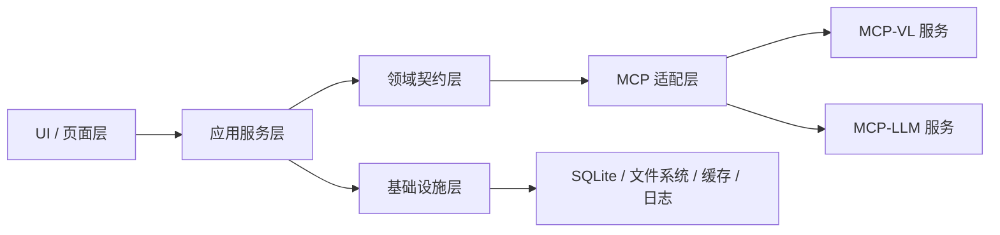
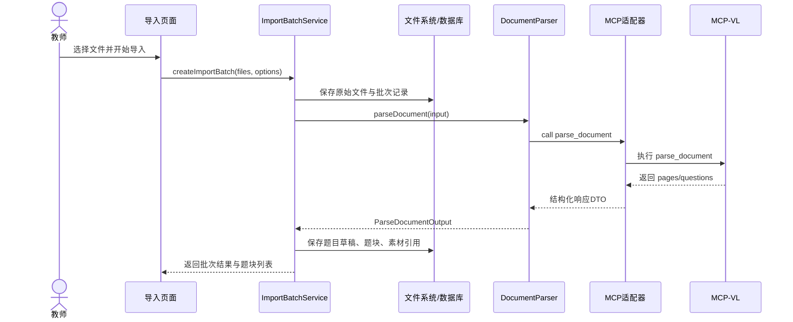
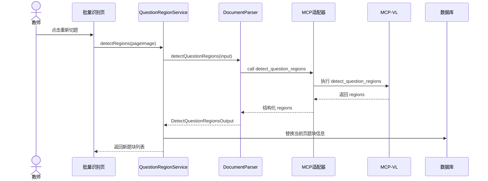
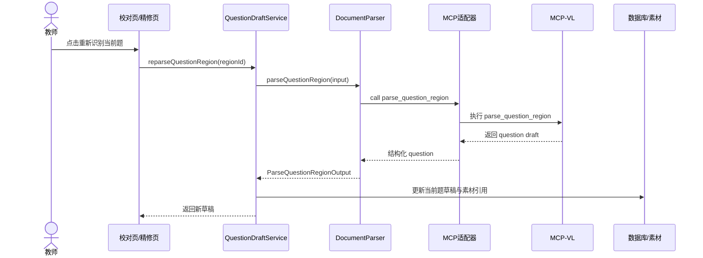
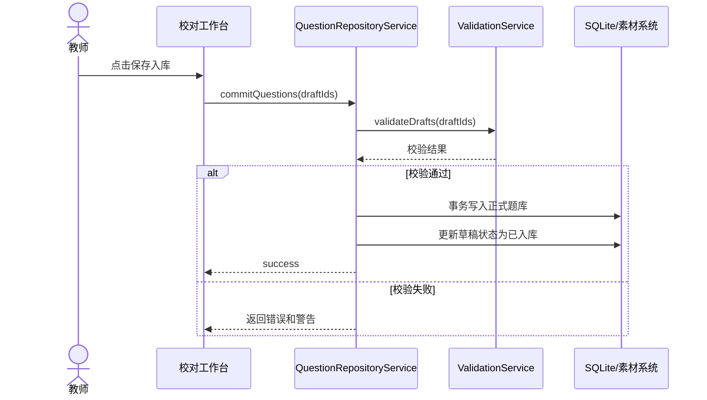
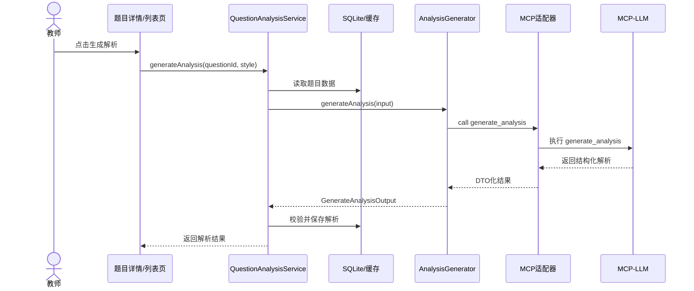
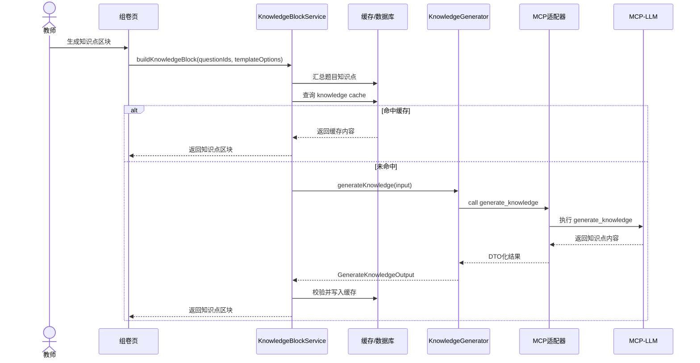
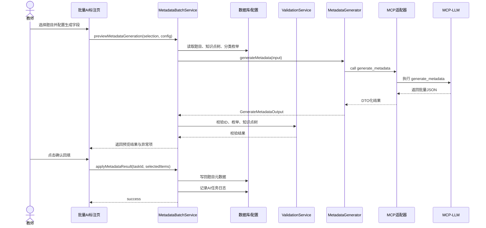
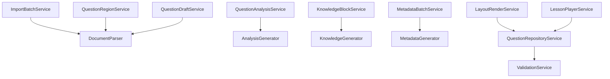
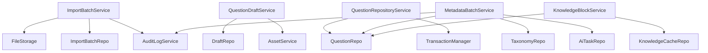

# 私有化高中物理题库系统｜MCP 时序图、模块依赖、错误码与服务装配

文档版本：V1.0  
更新时间：2026-07-26

## 一、目标

本文档用于补充 MCP 接口设计的落地方式，重点解决两个问题：

1. 主程序在不同业务场景下应如何调用 MCP 能力
2. 各模块之间应如何依赖，才能保持分离式框架、低耦合、易替换

## 二、总模块依赖关系

依赖方向必须单向：

`UI层 -> 应用服务层 -> 领域契约层 -> MCP适配层 -> MCP服务`



## 三、推荐主程序服务清单

### 3.1 导入与录题相关服务
1. `ImportBatchService`
2. `QuestionRegionService`
3. `QuestionDraftService`

### 3.2 题目生成与补全相关服务
1. `QuestionAnalysisService`
2. `KnowledgeBlockService`
3. `MetadataBatchService`

### 3.3 题库与组卷相关服务
1. `QuestionRepositoryService`
2. `CollectionService`
3. `BasketService`
4. `TemplateService`
5. `LayoutRenderService`
6. `LessonPlayerService`

### 3.4 基础支持服务
1. `AiTaskService`
2. `AssetService`
3. `ValidationService`
4. `AuditLogService`

## 四、核心业务时序图

### 4.1 导入文档并生成题目草稿



### 4.2 单页重新切题



### 4.3 单题重新识别



### 4.4 草稿校对后入库



### 4.5 为新题生成解析



### 4.6 组卷时生成知识点区块



### 4.7 批量 AI 生成知识点 / 标签 / 分类



## 五、模块依赖细化图

### 5.1 应用服务与领域契约依赖图



### 5.2 应用服务与基础设施依赖图



## 六、推荐应用服务接口

### 6.1 ImportBatchService

```ts
export interface ImportBatchService {
  createImportBatch(input: {
    files: string[];
    mode?: "auto" | "native_document" | "image_document";
  }): Promise<{ batchId: string }>;

  parseBatch(batchId: string): Promise<void>;
  retryFailedPages(batchId: string, pageNos: number[]): Promise<void>;
}
```

### 6.2 QuestionDraftService

```ts
export interface QuestionDraftService {
  reparseQuestionRegion(draftId: string): Promise<void>;
  updateDraft(input: {
    draftId: string;
    patch: Partial<StandardQuestion>;
  }): Promise<void>;
  saveDraft(draftId: string): Promise<void>;
}
```

### 6.3 QuestionRepositoryService

```ts
export interface QuestionRepositoryService {
  commitQuestions(draftIds: string[]): Promise<{
    successIds: string[];
    failedItems: Array<{ draftId: string; reason: string }>;
  }>;
}
```

### 6.4 QuestionAnalysisService

```ts
export interface QuestionAnalysisService {
  generateAnalysis(input: {
    questionId: string;
    style: "classroom_brief" | "self_study_full" | "exam_standard";
    overwrite?: boolean;
  }): Promise<void>;
}
```

### 6.5 MetadataBatchService

```ts
export interface MetadataBatchService {
  previewMetadataGeneration(input: {
    questionIds: string[];
    fields: string[];
    options: {
      onlyFillEmpty: boolean;
      strictEnumMatch: boolean;
    };
    promptAppend?: string;
  }): Promise<{
    taskId: string;
    previewItems: unknown[];
    warnings: AppWarning[];
    errors: AppError[];
  }>;

  applyMetadataResult(input: {
    taskId: string;
    selectedQuestionIds?: string[];
    selectedFields?: string[];
  }): Promise<void>;
}
```

## 七、推荐仓储接口

### 7.1 QuestionRepo

```ts
export interface QuestionRepo {
  findByIds(ids: string[]): Promise<StandardQuestion[]>;
  saveAnalysis(questionId: string, analysisText: string): Promise<void>;
  updateMetadata(questionId: string, patch: Record<string, unknown>): Promise<void>;
}
```

### 7.2 DraftRepo

```ts
export interface DraftRepo {
  findDraftById(draftId: string): Promise<ParsedQuestionDraft | null>;
  updateDraft(draftId: string, patch: Record<string, unknown>): Promise<void>;
  markCommitted(draftIds: string[]): Promise<void>;
}
```

### 7.3 KnowledgeCacheRepo

```ts
export interface KnowledgeCacheRepo {
  get(key: string): Promise<{ title: string; content: string } | null>;
  set(key: string, value: { title: string; content: string; outline: string[] }): Promise<void>;
}
```

### 7.4 AiTaskRepo

```ts
export interface AiTaskRepo {
  create(task: {
    taskId: string;
    type: string;
    inputSnapshot: unknown;
  }): Promise<void>;

  savePreview(taskId: string, preview: unknown): Promise<void>;
  markApplied(taskId: string): Promise<void>;
}
```

## 八、错误码设计

### 8.1 错误对象标准结构

```ts
export interface AppError {
  code: ErrorCode;
  message: string;
  target?: string;
  retryable: boolean;
  details?: Record<string, unknown>;
}
```

### 8.2 错误码类型定义

```ts
export type ErrorCode =
  | "MCP_TIMEOUT"
  | "MCP_PROCESS_EXITED"
  | "MCP_TOOL_NOT_FOUND"
  | "MCP_INVALID_RESPONSE"
  | "MCP_CALL_FAILED"
  | "INVALID_JSON"
  | "SCHEMA_VALIDATION_FAILED"
  | "MISSING_REQUIRED_FIELD"
  | "ENUM_OUT_OF_RANGE"
  | "QUESTION_ID_MISMATCH"
  | "KNOWLEDGE_POINT_INVALID"
  | "CATALOG_ID_INVALID"
  | "IMAGE_REFERENCE_MISSING"
  | "QUESTION_NOT_FOUND"
  | "DRAFT_NOT_FOUND"
  | "IMPORT_BATCH_NOT_FOUND"
  | "MANUAL_DATA_PROTECTED"
  | "AI_DISABLED"
  | "BATCH_PARTIAL_FAILED"
  | "COMMIT_VALIDATION_FAILED"
  | "ASSET_SAVE_FAILED"
  | "DB_WRITE_FAILED"
  | "CACHE_WRITE_FAILED";
```

### 8.3 警告码建议

```ts
export type WarningCode =
  | "LOW_CONFIDENCE_OCR"
  | "LOW_CONFIDENCE_FORMULA"
  | "POSSIBLE_DUPLICATE"
  | "MISSING_KNOWLEDGE_POINT"
  | "UNUSED_FIGURE"
  | "CACHE_MISS"
  | "PARTIAL_METADATA_EMPTY";
```

## 九、Mock 实现规范

Mock 的目标不是“随便返回点假数据”，而是让 UI、业务层、测试都能脱离真实模型稳定开发。

### 9.1 Mock 设计原则
1. 实现同一份领域契约接口
2. 返回稳定、可预测的数据
3. 支持模拟成功、失败、超时、部分失败
4. 不依赖真实模型和真实网络
5. 可通过参数控制测试场景

### 9.2 Mock 模式枚举

```ts
export type MockMode =
  | "success"
  | "partial_failure"
  | "invalid_json"
  | "timeout"
  | "empty_result";
```

### 9.3 Mock 配置结构

```ts
export interface MockConfig {
  mode: MockMode;
  delayMs?: number;
  seed?: number;
}
```

### 9.4 Disabled 实现规范

```ts
export class DisabledMetadataGenerator implements MetadataGenerator {
  async generateMetadata(): Promise<GenerateMetadataOutput> {
    throw {
      code: "AI_DISABLED",
      message: "AI service is disabled",
      retryable: false
    } satisfies AppError;
  }
}
```

## 十、服务容器初始化示例

### 10.1 容器接口

```ts
export interface ServiceContainer {
  documentParser: DocumentParser;
  analysisGenerator: AnalysisGenerator;
  knowledgeGenerator: KnowledgeGenerator;
  metadataGenerator: MetadataGenerator;

  importBatchService: ImportBatchService;
  questionDraftService: QuestionDraftService;
  questionRepositoryService: QuestionRepositoryService;
  questionAnalysisService: QuestionAnalysisService;
  metadataBatchService: MetadataBatchService;
}
```

### 10.2 生产环境装配示例

```ts
export function createProductionContainer(): ServiceContainer {
  const mcpClient = new StdioMcpClient({
    vlCommand: "mcp-vl.exe",
    llmCommand: "mcp-llm.exe"
  });

  const documentParser = new McpDocumentParser(mcpClient);
  const analysisGenerator = new McpAnalysisGenerator(mcpClient);
  const knowledgeGenerator = new McpKnowledgeGenerator(mcpClient);
  const metadataGenerator = new McpMetadataGenerator(mcpClient);

  const questionRepo = new SqliteQuestionRepo();
  const draftRepo = new SqliteDraftRepo();
  const importBatchRepo = new SqliteImportBatchRepo();
  const aiTaskRepo = new SqliteAiTaskRepo();
  const taxonomyRepo = new FileTaxonomyRepo();
  const assetService = new LocalAssetService();
  const validationService = new DefaultValidationService(taxonomyRepo, assetService);
  const auditLogService = new FileAuditLogService();

  return {
    documentParser,
    analysisGenerator,
    knowledgeGenerator,
    metadataGenerator,
    importBatchService: new DefaultImportBatchService(
      importBatchRepo,
      draftRepo,
      assetService,
      documentParser,
      auditLogService
    ),
    questionDraftService: new DefaultQuestionDraftService(
      draftRepo,
      assetService,
      documentParser
    ),
    questionRepositoryService: new DefaultQuestionRepositoryService(
      draftRepo,
      questionRepo,
      validationService
    ),
    questionAnalysisService: new DefaultQuestionAnalysisService(
      questionRepo,
      analysisGenerator
    ),
    metadataBatchService: new DefaultMetadataBatchService(
      questionRepo,
      taxonomyRepo,
      aiTaskRepo,
      metadataGenerator,
      validationService,
      auditLogService
    )
  };
}
```

## 十一、一条完整业务链路伪代码

### 11.1 从导入到入库

```ts
async function importAndCommitExample(
  container: ServiceContainer,
  filePath: string
) {
  const batch = await container.importBatchService.createImportBatch({
    files: [filePath],
    mode: "auto"
  });

  await container.importBatchService.parseBatch(batch.batchId);

  const draftIds = await getDraftIdsByBatchId(batch.batchId);

  for (const draftId of draftIds) {
    await container.questionDraftService.updateDraft({
      draftId,
      patch: {
        source: "2026届高三月考",
        tags: ["月考", "力学"]
      }
    });
  }

  const commitResult =
    await container.questionRepositoryService.commitQuestions(draftIds);

  return commitResult.successIds;
}
```

### 11.2 批量 AI 生成知识点并回填

```ts
async function batchGenerateMetadataExample(
  container: ServiceContainer,
  questionIds: string[]
) {
  const preview = await container.metadataBatchService.previewMetadataGeneration({
    questionIds,
    fields: ["knowledgePoints", "tags", "difficulty"],
    options: {
      onlyFillEmpty: true,
      strictEnumMatch: true
    },
    promptAppend: "知识点必须使用标准三级考点。"
  });

  if (preview.errors.length > 0) {
    throw new Error("预览阶段存在阻断错误");
  }

  const confirmedQuestionIds = preview.previewItems
    .filter(Boolean)
    .map((item: any) => item.id);

  await container.metadataBatchService.applyMetadataResult({
    taskId: preview.taskId,
    selectedQuestionIds: confirmedQuestionIds,
    selectedFields: ["knowledgePoints", "tags", "difficulty"]
  });
}
```

## 十二、推荐实现顺序

### 第一阶段
1. 定义领域契约
2. 定义 DTO 与错误码
3. 定义仓储接口
4. 定义 ServiceContainer

### 第二阶段
1. 先完成 Mock Provider
2. 先让 UI 跑通
3. 先让应用服务层串起来

### 第三阶段
1. 接真实 MCP Provider
2. 接 SQLite Repo
3. 接文件系统和日志
4. 补离线 Provider

### 第四阶段
1. 增加校验链
2. 增加任务审计
3. 增加缓存
4. 增加失败重试
